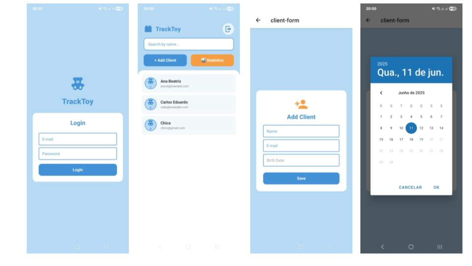
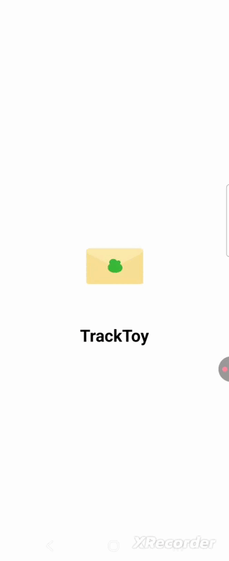
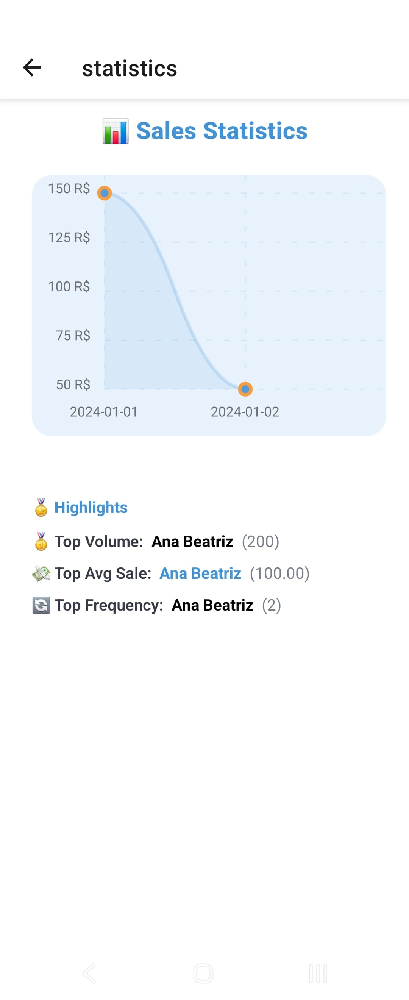

# 🧸 TrackToy

TrackToy is an Expo + React Native app built with **create-expo-app**, styled using NativeWind (Tailwind), and powered by Expo Router & Zustand.

---

## 🚀 Getting Started

### 1. Clone the repository:

   ```bash
   git clone https://github.com/FranciscoGabriel1/tracktoy.git
   cd tracktoy
   ``` 
### 2. Install dependencies:

   ```bash
   yarn install
   ``` 

### 3. Start the project:

   ```bash
   npx expo start -c
   ``` 
### Demo

|  |  |
|----------------------|------------------------|
In the output, you'll find options to open the app in a

- [development build](https://docs.expo.dev/develop/development-builds/introduction/)
- [Android emulator](https://docs.expo.dev/workflow/android-studio-emulator/)
- [iOS simulator](https://docs.expo.dev/workflow/ios-simulator/)
- [Expo Go](https://expo.dev/go), a limited sandbox for trying out app development with Expo

You can start developing by editing the files inside the **app** directory. This project uses [file-based routing](https://docs.expo.dev/router/introduction).

### 📁 Project Structure

   ```bash
   app/
├─ index.tsx        # Splash screen
├─ login.tsx        # Authentication screen
├─ clients.tsx      # Client list with search/filter
├─ client-form.tsx  # Add/Edit client form
├─ statistics.tsx   # Sales chart & highlights
└─ _layout.tsx      # Global layout/navigation

components/           # UI components (e.g., Charts, Highlights)
src/
├─ services/          # API mocks (fetchClients)
├─ store/             # Zustand state stores (auth, clients)
└─ utils/             # Helpers (normalizeClients, stats logic)

   ``` 
### 🎯 Features
- **Auth**: Simple login flow via Zustand store
- **Client Management**: Add/edit clients, prevent duplicates
- **Sales Analytics**: Charts for daily sales, top volume, average sales, and purchase frequency
- **Clean Architecture**: Modular screens, shared utilities, typed with TypeScript
- **Aliased Imports**: Use @/services, @/store, @/components, etc.

### ⚠️ Important Notes
> **Use Yarn:** npm install may fail due to peer dependency issues.

> **Starting Dev Mode**: Use `npx expo start -c` for a clean cache build.

## Learn more

To learn more about developing your project with Expo, look at the following resources:

- [Expo documentation](https://docs.expo.dev/): Learn fundamentals, or go into advanced topics with our [guides](https://docs.expo.dev/guides).
- [Learn Expo tutorial](https://docs.expo.dev/tutorial/introduction/): Follow a step-by-step tutorial where you'll create a project that runs on Android, iOS, and the web.

## Join the community

Join our community of developers creating universal apps.

- [Expo on GitHub](https://github.com/expo/expo): View our open source platform and contribute.
- [Discord community](https://chat.expo.dev): Chat with Expo users and ask questions.


Thanks for checking out TrackToy! Enjoy building with it. 🎉